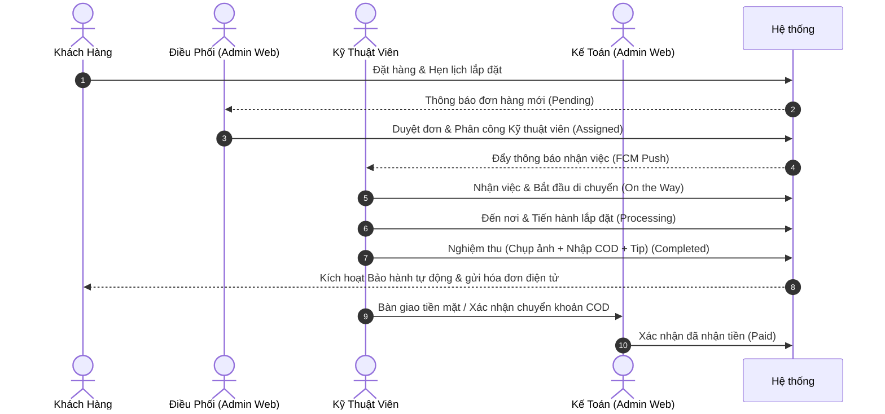

# 🌊 Hướng Dẫn Sử Dụng Hệ Thống AquaCareSystem

Chào mừng bạn đến với **AquaCareSystem** - Hệ thống quản lý bán hàng, lắp đặt và bảo trì máy lọc nước toàn diện. Tài liệu này cung cấp hướng dẫn chi tiết dành cho tất cả các đối tượng sử dụng hệ thống, bao gồm: **Khách hàng**, **Kỹ thuật viên**, **Điều phối viên**, **Kế toán**, và **Quản trị viên**.

---

## 📌 Tổng Quan Hệ Thống

AquaCareSystem là một giải pháp hợp nhất hoạt động trên nền tảng Firebase, bao gồm 3 ứng dụng chuyên biệt:

1. **Customer App (Mobile - Flutter)**: Dành cho Khách hàng mua sắm, đặt lịch, theo dõi đơn hàng và quản lý bảo hành.
2. **Technician App (Mobile - Flutter)**: Dành cho Kỹ thuật viên nhận nhiệm vụ, chỉ đường, cập nhật trạng thái thi công, chụp ảnh nghiệm thu và thu hộ COD.
3. **Admin Web (Web - React + TS + Vite)**: Bảng điều khiển quản trị tập trung dành cho đội ngũ vận hành nội bộ cửa hàng.

### 🔄 Quy Trình Nghiệp Vụ Cốt Lõi (Core Workflow)

Dưới đây là quy trình phối hợp hoạt động từ lúc khách hàng phát sinh nhu cầu đến khi hoàn tất dịch vụ:



---

## 📱 Phần 1: Hướng Dẫn Dành Cho Khách Hàng (Customer App)

Ứng dụng giúp khách hàng tiếp cận sản phẩm dễ dàng, đặt lịch nhanh chóng và tự động hóa quá trình hậu mãi.

### 1. Đăng ký & Đăng nhập
*   **Đăng ký tài khoản**: Nhập Họ tên, Số điện thoại (bắt buộc dạng `0XXXXXXXXX`), Email và Mật khẩu. Xác thực vị trí qua GPS để hỗ trợ giao hàng sau này.
*   **Đăng nhập**: Sử dụng Email và Mật khẩu đã đăng ký. Hệ thống hỗ trợ tính năng "Ghi nhớ mật khẩu".

### 2. Xem sản phẩm & Đặt hàng
*   **Trang chủ**: Xem danh sách các mẫu máy lọc nước mới nhất, bộ lọc theo thương hiệu, giá cả hoặc công nghệ lọc (RO, Nano, UV).
*   **Chi tiết sản phẩm**: Xem thông tin kỹ thuật, thời hạn bảo hành (ví dụ: 12 tháng, 24 tháng) và mô tả chi tiết.
*   **Đặt hàng**:
    1. Chọn sản phẩm và số lượng.
    2. Nhập thông tin giao hàng: Hệ thống hỗ trợ định vị bản đồ trực quan hoặc tự động hoàn thiện thông qua gợi ý địa chỉ (Google Places API).
    3. Chọn thời gian lắp đặt mong muốn: Chọn ngày và khung giờ hẹn (ví dụ: `08:00 - 10:00`, `10:00 - 12:00`, v.v.).
    4. Xác nhận đơn hàng.

### 3. Theo Dõi Đơn Hàng & Lịch Hẹn
*   Khách hàng có thể vào mục **Đơn hàng của tôi** để xem trạng thái thời gian thực của đơn hàng:
    *   `Chờ duyệt` (Pending): Đơn hàng đã được tạo thành công, chờ cửa hàng xác nhận.
    *   `Đã gán KTV` (Assigned): Hệ thống đã phân công kỹ thuật viên đảm nhận. Khách hàng có thể xem tên, số điện thoại và đánh giá của KTV.
    *   `Đang thực hiện` (Processing): KTV đang trên đường đến hoặc đang tiến hành lắp đặt tại nhà.
    *   `Đã hoàn thành` (Completed): KTV đã bàn giao thiết bị chạy ổn định.
*   Khách hàng nhận được thông báo đẩy (Push Notification) mỗi khi trạng thái đơn hàng thay đổi.

### 4. Quản Lý Thiết Bị & Bảo Hành
*   **Thiết bị đã lắp**: Sau khi đơn hàng hoàn thành, sản phẩm tự động được chuyển vào danh mục **Thiết bị của tôi** kèm theo Mã định danh định dạng QR Code/Serial.
*   **Tra cứu bảo hành**: Hiển thị thời hạn bảo hành còn lại, lịch sử các lần bảo trì/sửa chữa đã thực hiện.
*   **Yêu cầu dịch vụ**: Khách hàng có thể gửi yêu cầu bảo trì định kỳ hoặc báo hỏng trực tiếp từ trang thiết bị. Hệ thống sẽ tự động tạo đơn hàng thuộc loại `maintenance` (bảo trì) hoặc `repair` (sửa chữa).

---

## 📱 Phần 2: Hướng Dẫn Dành Cho Kỹ Thuật Viên (Technician App)

Ứng dụng di động giúp Kỹ thuật viên quản lý lịch trình làm việc hàng ngày hiệu quả và báo cáo kết quả thi công nhanh chóng.

> [!IMPORTANT]
> **Bắt buộc đổi mật khẩu ở lần đăng nhập đầu tiên:**
> Khi được Admin cấp tài khoản nội bộ mới, KTV đăng nhập bằng mật khẩu tạm thời. Hệ thống sẽ tự động chuyển hướng đến màn hình bảo mật yêu cầu đổi mật khẩu mới (tối thiểu 8 ký tự, bao gồm chữ hoa, chữ thường và số) trước khi sử dụng ứng dụng.

### 1. Danh sách công việc hàng ngày
*   **Trang chủ (Dashboard)**: Hiển thị thống kê nhanh số công việc hôm nay, số đơn đã hoàn thành và số đơn đang xử lý.
*   **Danh sách công việc**: Hiển thị các phiếu việc được phân công, sắp xếp theo thời gian hẹn và độ ưu tiên tăng dần. KTV có thể lọc danh sách theo trạng thái (`Chờ thực hiện`, `Đang di chuyển`, `Đang lắp đặt`, `Đã hoàn thành`).

### 2. Quy trình thực hiện đơn hàng (Vòng đời trạng thái)
KTV phải cập nhật trạng thái tuần tự ngay trên ứng dụng khi thực hiện dịch vụ:

```
[Chờ thực hiện] ➔ Nhấn "Bắt đầu đi" ➔ [Đang di chuyển] ➔ Nhấn "Đã đến nơi" ➔ [Đang lắp đặt] ➔ Nhấn "Nghiệm thu" ➔ [Đã hoàn thành]
```

*   **Đang di chuyển (On the Way)**: Nhấn nút di chuyển để hệ thống thông báo cho khách hàng chuẩn bị. KTV có thể bấm nút **Chỉ đường** để mở Google Maps điều hướng trực tiếp tới nhà khách hàng dựa trên tọa độ GPS của đơn hàng.
*   **Đang lắp đặt/xử lý (Processing)**: Tiến hành khui thùng, lắp ráp máy lọc nước hoặc thay lõi lọc theo yêu cầu kỹ thuật.
*   **Nghiệm thu & Hoàn thành (Completed)**:
    1.  Bấm chọn nút nghiệm thu đơn hàng.
    2.  **Chụp ảnh thực tế**: Chụp tối đa 5 ảnh nghiệm thu (vị trí lắp đặt, đường ống nước, thông số đo nước sau lọc, chữ ký biên bản của khách hàng).
    3.  **Nhập thông tin tài chính**:
        *   Nhập số tiền thu hộ thực tế (**COD**): Có thể khớp với giá trị đơn hàng hoặc chênh lệch tùy theo phát sinh vật tư bổ sung được Admin duyệt.
        *   Nhập số tiền **Tip** (nếu có) được khách hàng thưởng.
    4.  Nhấn **Xác nhận hoàn thành**. Hệ thống sẽ tự động đồng bộ hóa dữ liệu lên Firestore.

### 3. Báo cáo sự cố (Report Incident)
*   Nếu gặp khó khăn trong quá trình thi công (ví dụ: mất điện, nguồn nước đầu vào không đủ áp lực, thiếu linh kiện phát sinh, khách hàng hẹn lịch khác, v.v.), KTV chọn chức năng **Báo cáo sự cố**.
*   Trạng thái đơn hàng sẽ chuyển sang `incident` (sự cố) kèm lý do chi tiết để Điều phối viên tại Web Admin nắm thông tin và hỗ trợ xử lý kịp thời.

---

## 💻 Phần 3: Hướng Dẫn Dành Cho Đội Ngũ Quản Trị (Admin Web)

Trang Web quản trị dành cho ba vai trò vận hành chính: **Admin (Quản trị viên)**, **Coordinator (Điều phối viên)** và **Accountant (Kế toán)**.

### 1. Giao Diện Dashboard (Bảng Điều Khiển KPI)
*   **Số liệu tổng quan**: Xem tổng doanh thu trong ngày/tuần/tháng, số lượng đơn hàng mới phát sinh, số lượng KTV đang online làm việc ngoài hiện trường.
*   **Biểu đồ**: Biểu đồ doanh thu trực quan theo thời gian và biểu đồ phân bổ trạng thái đơn hàng giúp quản lý đưa ra quyết định kinh doanh.

### 2. Quản Lý Đơn Hàng (Orders)
Màn hình trung tâm quản lý toàn bộ các giao dịch phát sinh trong hệ thống.
*   **Bộ lọc thông minh**: Tìm kiếm đơn hàng theo Mã đơn hàng (`ORD-YYYY-XXXXX`), Số điện thoại khách hàng, loại đơn hàng (`home`, `installation`, `maintenance`, `repair`), và trạng thái đơn hàng.
*   **Chi tiết đơn hàng**: Xem đầy đủ thông tin khách hàng, danh sách sản phẩm đặt mua, ghi chú, lịch hẹn lắp đặt và bản đồ tọa độ GPS của địa chỉ giao hàng.
*   **Điều phối & Phân công Kỹ thuật viên (Assign)**:
    *   Đối với các đơn hàng ở trạng thái `pending` (chờ duyệt), bấm chọn **Phân công**.
    *   Hệ thống hiển thị danh sách Kỹ thuật viên kèm trạng thái hiện tại (Đang bận/Rảnh) và vị trí của họ.
    *   Chọn một hoặc nhiều KTV tham gia thực hiện đơn hàng, chỉ định một **KTV chính (Primary Technician)** chịu trách nhiệm báo cáo.
    *   Trạng thái đơn hàng tự động chuyển sang `assigned`.
*   **Điều chỉnh chi phí**: Cho phép sửa đổi các trường giá trị như `Shipping Fee` (phí vận chuyển), `Discount` (giảm giá) hoặc giá trị vật tư phát sinh trước khi KTV tiến hành nghiệm thu thanh toán.

### 3. Quản Lý Kỹ Thuật Viên & Lịch Làm Việc (Technicians & Schedule)
*   **Danh sách Kỹ thuật viên**: Theo dõi danh sách KTV, thông tin liên hệ, hiệu suất làm việc (số đơn đã hoàn thành) và đánh giá trung bình (Rating) từ khách hàng.
*   **Lịch điều phối (Schedule Calendar)**: Xem biểu đồ phân bổ lịch hẹn theo dạng lịch tuần/tháng. Giúp điều phối viên nhanh chóng phát hiện các ngày bị quá tải hoặc trùng lịch của KTV để điều phối lại khung giờ phù hợp.

### 4. Quản Lý Sản Phẩm & Kho Hàng (Products & Inventory)
*   **Danh mục sản phẩm**: Hỗ trợ các thao tác Thêm mới, Chỉnh sửa thông tin và Xóa sản phẩm. Các thông tin cấu hình bao gồm: Tên sản phẩm, Thương hiệu, Công nghệ lọc, Đơn giá, Thời hạn bảo hành mặc định, và Hình ảnh mô tả.
*   **Quản lý kho hàng**: Theo dõi số lượng tồn kho của máy lọc nước và các linh kiện thay thế (lõi lọc số 1, 2, 3, màng RO, v.v.). Hệ thống tự động cảnh báo khi lượng tồn kho xuống dưới mức tối thiểu.

### 5. Quản Lý Khách Hàng & Thiết Bị (Customers & Devices)
*   **CRM Khách hàng**: Quản lý thông tin liên hệ, địa chỉ thường trú và lịch sử đặt hàng của từng khách hàng.
*   **Quản lý Thiết bị (Devices)**:
    *   Lưu trữ danh sách toàn bộ các máy lọc nước đã được lắp đặt thành công ngoài thực tế.
    *   Mỗi thiết bị được cấp một mã Serial duy nhất và liên kết với tài khoản khách hàng để phục vụ hoạt động bảo hành định kỳ.
*   **Quản lý Bảo hành (Warranty)**: Theo dõi thời hạn bảo hành của thiết bị, thiết lập cảnh báo tự động nhắc nhở khách hàng thay lõi lọc định kỳ (ví dụ: lõi thô sau 6 tháng, màng lọc RO sau 24 tháng).

### 6. Báo Cáo & Kế Toán (Reports & Accounting)
*   **Báo cáo tài chính**: Xuất dữ liệu báo cáo doanh thu bán hàng, chi phí vận hành theo định dạng Excel/PDF.
*   **Đối soát COD (Kế toán)**:
    *   Khi KTV nghiệm thu đơn hàng hoàn tất (`completed`), kế toán truy cập mục đối soát để kiểm tra số tiền COD thực nhận từ KTV (qua tiền mặt hoặc chuyển khoản ngân hàng).
    *   Bấm **Xác nhận thanh toán** để chuyển trạng thái đơn hàng sang `paid` (Đã thanh toán) và cập nhật doanh thu chính thức vào hệ thống.
*   **Tính lương KTV**: Hệ thống hỗ trợ tính toán tự động thu nhập của KTV dựa trên: `Lương cơ bản + (Số đơn hoàn thành * Hoa hồng trên mỗi đơn) + Tiền Tip thực nhận`.

### 7. Thiết Lập & Bảo Mật (Chỉ dành cho Admin)
*   **Quản lý người dùng nội bộ (Users)**:
    *   Phê duyệt các tài khoản đăng ký mới của nhân viên.
    *   Gán quyền hạn tương ứng (`Admin`, `Coordinator`, `Accountant`, `Technician`).
    *   Kích hoạt (`active`) hoặc Khóa (`blocked`) tài khoản nhân viên.
*   **Cấu hình lương & hoa hồng**: Thiết lập lương cơ bản (`baseSalary`) và mức hoa hồng cố định trên từng đơn hàng (`commissionPerOrder`) áp dụng cho mỗi Kỹ thuật viên để phục vụ tính lương.
*   **Nhật ký hệ thống (Audit Logs)**: Ghi lại toàn bộ lịch sử các thao tác nhạy cảm trên hệ thống (ai đã sửa đơn hàng, ai đã đổi quyền người dùng, thời gian thực hiện) nhằm phục vụ công tác hậu kiểm bảo mật.

---

## 🔐 Phân Quyền Người Dùng (Role-Based Access Control)

Hệ thống phân quyền nghiêm ngặt dựa trên vai trò để đảm bảo an toàn thông tin và tính chuyên môn hóa:

| Chức năng | Khách hàng (Customer) | Kỹ thuật viên (Technician) | Điều phối viên (Coordinator) | Kế toán (Accountant) | Quản trị viên (Admin) |
| :--- | :---: | :---: | :---: | :---: | :---: |
| **Xem sản phẩm & Tạo đơn hàng** | ✅ | ❌ | ✅ | ✅ | ✅ |
| **Theo dõi trạng thái đơn cá nhân** | ✅ | ❌ | ❌ | ❌ | ❌ |
| **Cập nhật quy trình thi công đơn được giao** | ❌ | ✅ | ❌ | ❌ | ❌ |
| **Xem & Tìm kiếm tất cả đơn hàng** | ❌ | ❌ | ✅ | ✅ | ✅ |
| **Duyệt đơn & Phân công KTV** | ❌ | ❌ | ✅ | ❌ | ✅ |
| **Đối soát & Xác nhận COD** | ❌ | ❌ | ❌ | ✅ | ✅ |
| **Thêm/Sửa/Xóa Sản phẩm** | ❌ | ❌ | ✅ | ✅ | ✅ |
| **Xem báo cáo tài chính & doanh thu** | ❌ | ❌ | ❌ | ✅ | ✅ |
| **Cấu hình nhân sự, Phân quyền & Duyệt tài khoản** | ❌ | ❌ | ❌ | ❌ | ✅ |
| **Thiết lập lương & hoa hồng KTV** | ❌ | ❌ | ❌ | ❌ | ✅ |
| **Xem Nhật ký Audit Logs** | ❌ | ❌ | ❌ | ❌ | ✅ |

---

## 🛠️ Hướng Dẫn Khắc Phục Sự Cố Thường Gặp (Troubleshooting)

### 1. Không nhận được thông báo đẩy (Push Notification)
*   **Hiện tượng**: Khách hàng hoặc KTV không nhận được thông báo khi trạng thái đơn hàng thay đổi.
*   **Cách khắc phục**:
    1. Kiểm tra quyền cấp phép thông báo trên thiết bị di động (Vào Cài đặt hệ điều hành ➔ AquaCare/AquaCare Tech ➔ Cấp quyền Thông báo).
    2. Đảm bảo thiết bị có kết nối Internet ổn định.
    3. Đối với lập trình viên: Xác minh cấu hình Firebase Cloud Messaging (FCM) và kiểm tra xem Token thiết bị đã được lưu đúng vào document người dùng trong Firestore chưa.

### 2. Không thể cập nhật trạng thái đơn hàng (Dành cho KTV)
*   **Hiện tượng**: Nút cập nhật trạng thái bị mờ hoặc báo lỗi khi nhấn chọn.
*   **Cách khắc phục**:
    1. Kiểm tra xem bạn có phải là **Kỹ thuật viên chính (Primary)** được phân công cho đơn hàng đó hay không. Chỉ KTV chính mới có quyền cập nhật tiến độ thi công.
    2. Đảm bảo cập nhật trạng thái theo đúng trình tự (không thể nhảy cóc từ `assigned` sang `completed` mà không qua bước trung gian).
    3. Đảm bảo đã điền đầy đủ các thông tin bắt buộc khi nghiệm thu (chụp ảnh, nhập COD và Tip).

### 3. Lỗi phân quyền truy cập trang quản trị (Admin Web)
*   **Hiện tượng**: Đăng nhập thành công nhưng màn hình báo lỗi không có quyền truy cập hoặc tự động chuyển hướng về trang chủ.
*   **Cách khắc phục**:
    1. Liên hệ với Quản trị viên tối cao (Super Admin) kiểm tra xem tài khoản của bạn đã được duyệt trạng thái sang `active` chưa.
    2. Kiểm tra vai trò (Role) của tài khoản trong Firestore đã được gán đúng chưa. Cần thực hiện đăng xuất và đăng nhập lại để làm mới Firebase Custom Claims trên trình duyệt.

### 4. Định dạng dữ liệu không hợp lệ khi tạo đơn hàng
*   **Hiện tượng**: Hệ thống báo lỗi khi nhập số điện thoại hoặc tính toán sai tổng tiền.
*   **Cách khắc phục**:
    1. Số điện thoại khách hàng phải bắt đầu bằng số `0` và có đúng `10` chữ số (ví dụ: `0912345678`).
    2. Tổng số tiền phải khớp với công thức: `Tổng cộng = Thành tiền sản phẩm - Giảm giá + Phí vận chuyển`. Nếu có sự chênh lệch dù chỉ 1 đồng, hệ thống Firestore Security Rules sẽ từ chối ghi dữ liệu để đảm bảo an toàn tài chính.

---

*Nếu gặp các lỗi kỹ thuật nằm ngoài danh mục trên, vui lòng liên hệ Bộ phận Kỹ thuật Hệ thống AquaCare để được hỗ trợ.*
